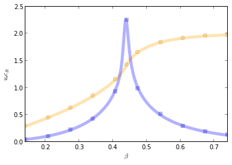

Efficient simulation of the random-cluster model
================================================

*Current version: 0.0.3*

Description
-----------
Sweeny's algorithm is a Markov Chain Monte Carlo algorithm for the random-cluster model (RCM).

The RCM captures models such as Bond-Percolation, Ising model, Potts model or Uniform Spanning Trees.

The computationally demanding problem of Sweeny's algorithm is the 
problem of obtaining connectivity-information while the graph is modified by
edge insertions/deletions. 

This project is a collection of 4 different implementations of Sweeny's algorithm for the RCM
in 2d on the square lattice. 

All, except the Dynamic Connectivity implementation, have average run-times which are powers 
of the system size at the critical point of the simulated model - that is where usually 
cluster-algorithms are used.

All four implementations include sampling facilities for time-series of the following 
observables:

* Number of active edges (internal energy)
* Number of clusters/components
* Size of largest component (order parameter)
* Sum of squared-cluster sizes (Susceptibility

Python module
-------------
I provide a Python module for easy usage of any of the before-mentioned variants of Sweeny's algorithm.

The core-program is written in C and the Python module wraps the Sweeny-C-library using ctypes.

This gives the ease and elegance of Python in combination with the "performance" of C.

Alternatively it is also possible to run the simulation in standalone binary files thanks to the 
Sweeny-C-library. See below for usage examples.

Examples/Usage
--------------
To use Sweeny's algorithm in Python we import the module Sweeny and create an instance of it
with the desired parameters:

.. code:: python

    from sweeny import Sweeny
    sy = Sweeny(2,64,np.log(1 + np.sqrt(2)),1.,1000,10000,1234567,impl='dc')
    sy.simulate()

This runs a simulation for the Ising model with 64 vertices per dimension, at the critical point :math:`\beta_c = \log{(1+\sqrt{2})}`, with a equilibration
of `1000` sweeps and `10000` sweeps of sampling. The implementation used above is defined by the abbreviation *'dc'* which corresponds
to the Dynamic Connectivity implementation. To extract, for example, the time-series of active edges and size of the largest component, 
we do:

.. code:: python

    num_bonds,size_giant =\ sy.ts_num_bonds, sy.ts_size_giant

Once we have an instance of the Sweeny class it is easy to start another simulation (here for Percolation, using the Interleaved BFS 
implementation, *'ibfs'*) from which we extract the binder-cummulant:

.. code:: python
    
    sy.init_sim(1,64,np.log(2),1.,1000,10000,1234567,impl='ibfs')
    sy.simulate()
    sec_cs_moment,four_cs_moment= sy.ts_sec_cs_moment,sy.ts_four_cs_moment
    sec_cs_moment *= sec_cs_moment
    binder_cummulant = four_cs_moment.mean()/sec_cs_moment.mean()
    del sy

Alternatively it is also possible to use compiled binaries for all three different implementations:

.. code:: sh

    ./sy_uf_mc.bin -l 64 -q 2 -b $(python - c "import numpy as np; print np.log(1 + np.sqrt(2))") -m 10000 -j 1 -c 1000 -s 1234567
    ./sy_sbfs_mc.bin -l 64 -q 1 -b $(python - c "import numpy as np; print np.log(2)") -m 10000 -j 1 -c 1000 -s 1234567

This simulates the Ising model using the Union-Find *'uf'* based implementation and Percolation using the Sequential BFS, *'sbfs'*, method .

Dependencies
------------
To compile the source code you need:

To use the Python module:

- GNU Scientific Library (GSL) version `>= 1.1`
- Python version `>= 2.5`
- NumPy version `>= 1.7`
- 

To use the standalone binaries:

- GNU Scientific Library (GSL) version `>= 1.1`
- Hierachical Data Format 5 (HDF5) version `>= 1.8`

Installation
------------
Make sure that none of the dependencies is missing. After that just run the Makefile with
the appropiate target:

.. code:: sh
   
    make python_interface # only python interface
    make bins # only binaries
    make # both

IPython Notebook to compare to (available) exact results
--------------------------------------------------------
An IPython Notebook provides a naïve (zero order) test of
all algorithms by comparing the active-bond time-series to 
exact results available for the 2d Ising model.

TODO
----
- Clean up code; Proper indentation
- Change from <linux/types.h> data types to <stdint.h> types for better portability
- Add export/saving routines to Sweeny class (h5py)
- Try some other balanced binary search trees
- Extend to other Graphs like cubic lattice
- Find alternative approaches to the connectivity problem

References
----------
- Mark Sweeny's original paper: http://prb.aps.org/abstract/PRB/v27/i7/p4445_1
- Article describing this work and in-depth analysis: http://pre.aps.org/abstract/PRE/v88/i3/e033303 **(Please refer to this work when using this source code/program)**
- Dynamic Connectivity algorithm used in this work: http://dl.acm.org/citation.cfm?id=502095
- Splay trees which underlie the whole implementation: http://dl.acm.org/citation.cfm?id=3835 
